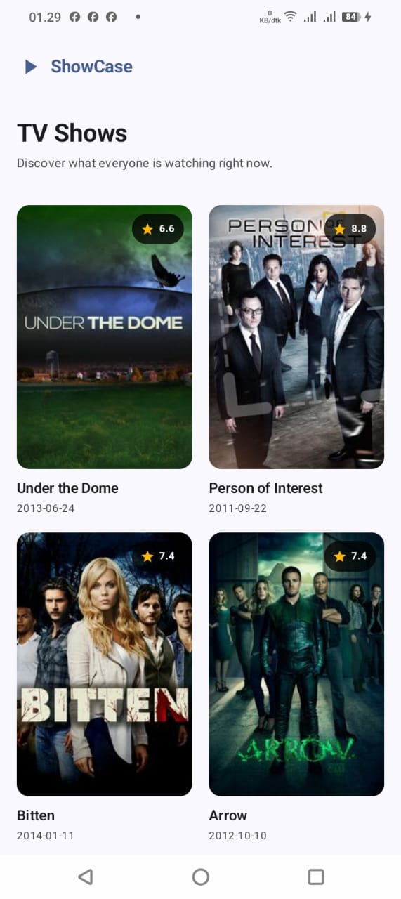
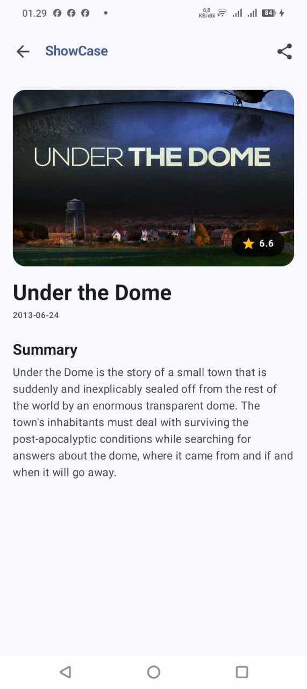
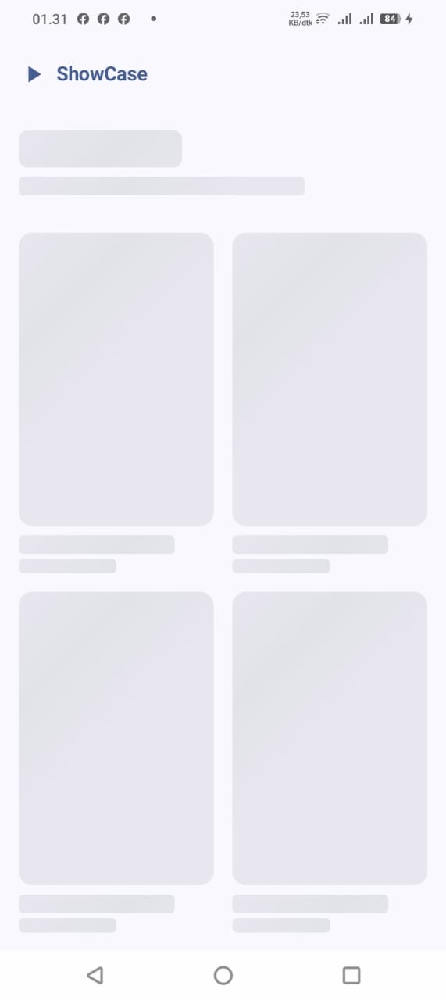
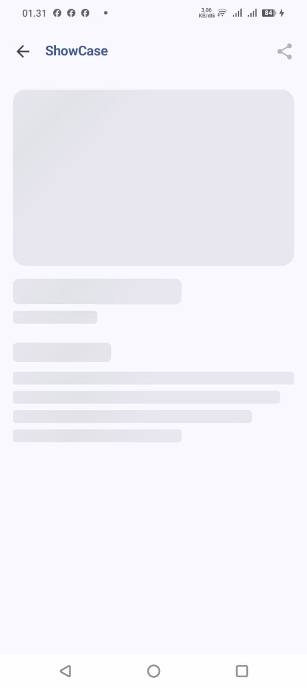
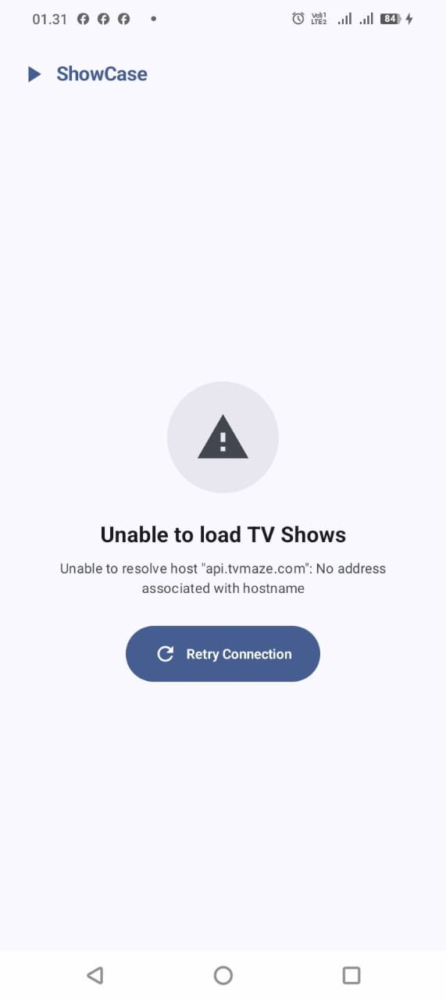
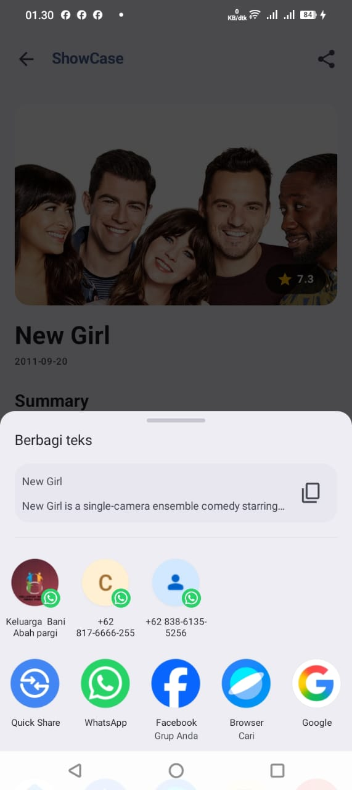

# ShowCase

ShowCase is a modern Android application built with Kotlin and Jetpack Compose for browsing television shows using the public [TVMaze API](https://www.tvmaze.com/api). The application demonstrates modern Android development practices, Clean Architecture, MVVM design pattern, reactive state management, and unit testing.

---

<p align="center">
  
  
</p>

---

Developed as part of the Mobile Engineer Intern Technical Assessment (Mamikos).

---

## Features

- **Browse TV Shows**: View a grid list of television shows featuring posters, titles, premiere dates, and rating badges.
- **Infinite Scrolling Pagination (Bonus)**: Automatically loads additional TV shows as users scroll to the bottom of the list using manual pagination.
- **Show Details**: Inspect detailed show information including large poster artwork, rating, premiere date, and sanitized plain text summaries.
- **Season, Episode & Cast (Bonus)**: View the total number of seasons, total episodes, and the top five cast members for each TV show.
- **Share Action**: Easily share TV show details (Title, Summary, and official TVMaze URL) via Android's native `ACTION_SEND` intent.
- **UI State Handling**: Explicit handling for `Loading`, `Error` (with Retry), `Success`, and pagination loading/error states.
- **Responsive Compose UI**: Built with Material Design 3 and Jetpack Compose.
- **Unit Testing**: Repository and ViewModel layers are covered with JUnit 4, MockK, and `kotlinx-coroutines-test`.

## Bonus Features

The application also implements both optional bonus requirements from the technical assessment:

- ✅ Infinite scrolling pagination for the TV show list using manual pagination.
- ✅ Display of total seasons, total episodes, and top five cast members on the Detail Screen.

These features were implemented while preserving the existing MVVM architecture without introducing Android Paging 3 or changing the application's core structure.

---

## Screenshots

### Home Screen

<p align="center">
  
</p>

### Detail Screen

<p align="center">
  
</p>

### Loading States

<p align="center">
  
  
</p>

### Error State

<p align="center">
  
</p>

### Share Feature

<p align="center">
  
  
</p>

---

## Tech Stack

- **Language**: [Kotlin](https://kotlinlang.org/) (2.0.21)
- **UI Framework**: [Jetpack Compose](https://developer.android.com/jetpack/compose) with Material Design 3
- **Architecture**: MVVM + Clean Architecture (Layered separation of concerns)
- **Asynchronous Execution**: Kotlin Coroutines & `StateFlow`
- **Networking**: [Retrofit 2](https://square.github.io/retrofit/) & [OkHttp 4](https://square.github.io/okhttp/)
- **JSON Serialization**: [Kotlinx Serialization](https://kotlinlang.org/docs/serialization.html)
- **Image Loading**: [Coil Compose](https://coil-kt.github.io/coil/) (`AsyncImage`)
- **Navigation**: [Navigation Compose](https://developer.android.com/jetpack/compose/navigation)
- **Unit Testing**: [JUnit 4](https://junit.org/junit4/), [MockK](https://mockk.io/), and `kotlinx-coroutines-test`

---

## Architecture

The project follows a layered architecture to maintain single responsibility, unidirectional data flow, and high testability:

```
app/src/main/java/io/github/bagascahyawiguna/showcase/
├── common/
├── data/
├── domain/
├── presentation/
└── ui/
```

- **`common/`**: Contains shared network client modules and utility helpers (HTML sanitizer, Share intent launcher).
- **`data/`**: Manages remote API services, DTO serialization models, data mappers, and repository implementations.
- **`domain/`**: Defines core business domain models (`TvShow`) and repository interface abstractions.
- **`presentation/`**: Houses Jetpack Compose screens, reusable UI components, UI state interfaces, ViewModels, and navigation graphs.
- **`ui/`**: Contains Material Design 3 color palettes and typography theme configurations.

---

## Project Structure

```
ShowCase/
├── app/
│   └── src/
│       ├── main/
│       │   ├── java/io/github/bagascahyawiguna/showcase/
│       │   │   ├── common/
│       │   │   ├── data/
│       │   │   ├── domain/
│       │   │   ├── presentation/
│       │   │   ├── ui/
│       │   │   └── MainActivity.kt
│       │   └── AndroidManifest.xml
│       └── test/
│           └── java/io/github/bagascahyawiguna/showcase/
│               ├── data/repository/
│               ├── presentation/viewmodel/
│               └── util/
├── docs/
├── gradle/
├── build.gradle.kts
└── settings.gradle.kts
```

---

## Getting Started

### Prerequisites

- Android Studio Ladybug (2024.2.1) or higher
- JDK 11 or higher
- Android SDK version 36 (Min SDK 24)

### Installation & Execution

1. **Clone the repository**:
   ```bash
   git clone https://github.com/bagascahyawiguna/mamikos-mobile-engineer-challenge.git
   cd mamikos-mobile-engineer-challenge
   ```
2. **Open project**: Open the cloned directory in Android Studio.
3. **Gradle Sync**: Allow Android Studio to automatically download dependencies and sync Gradle.
4. **Run Application**: Select an Android emulator or connected device (API 24+) and click **Run 'app'**.

---

## Running Tests

Unit tests cover the Repository data mapping/error handling and ViewModel state emissions.

To run all unit tests from the command line:

```bash
./gradlew test
```

On Windows:

```cmd
.\gradlew.bat test
```

---

## AI Usage

AI assistant tools (Gemini / Antigravity) were utilized during development as implementation assistants to assist with task breakdown, dependency setup, and routine boilerplate generation. Architectural decisions, API contracts, debugging, manual QA, code reviews, and unit test verifications were executed manually.

---

## Future Improvements

Given additional time, the following enhancements could be incorporated into the codebase:

- **Offline Caching**: Add local persistence using Room Database / DataStore for offline browsing.
- **Dependency Injection**: Integrate Hilt or Koin to manage ViewModels and Repository singletons cleanly.
- **UI / Screenshot Testing**: Add Compose UI tests and screenshot regression tests.
- **Accessibility**: Enhance TalkBack screen reader content descriptions and dynamic font scale support.

---

---

## Walkthrough Video

A complete walkthrough demonstrating the application, including the required technical assessment topics:

- Application demo (including Loading, Error, Success, Retry, and bonus features)
- Explanation of the project file I am most proud of
- One example of an AI-generated mistake and how it was identified and corrected

**Video:**

https://drive.google.com/drive/folders/1Gkhl3GCTGaJAC7ss_fNPiMX4paLFTBVi?usp=drive_link
